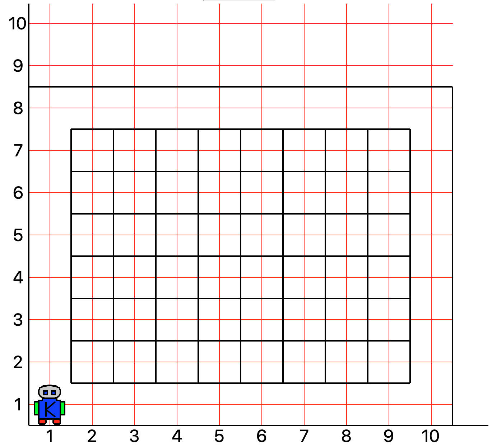
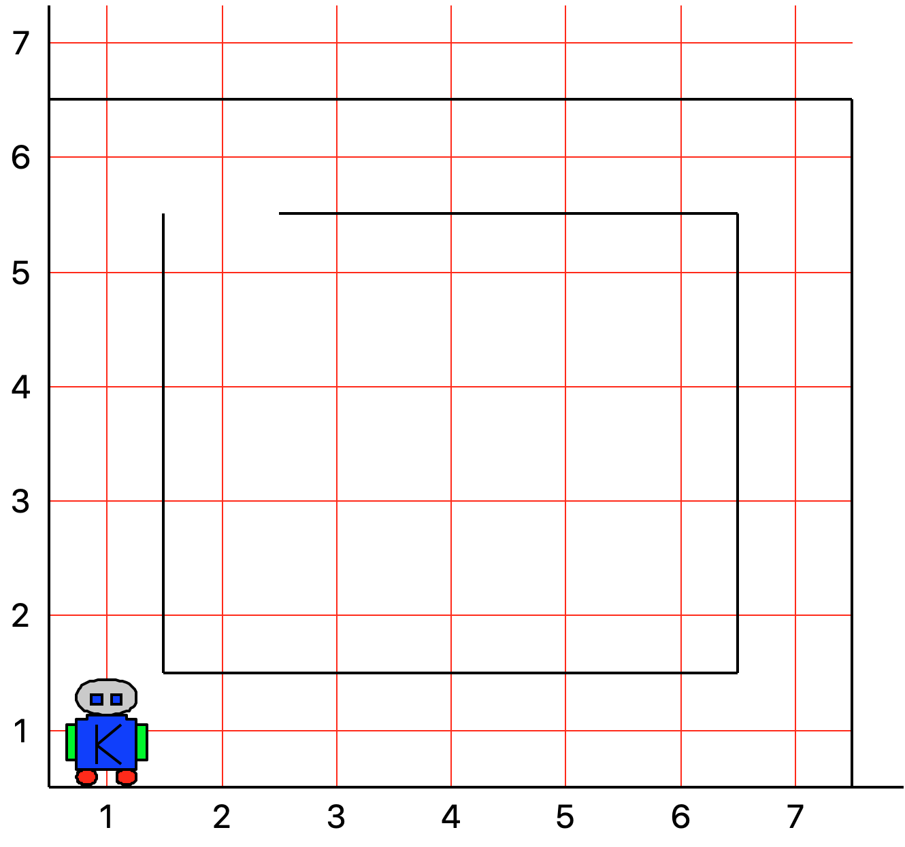
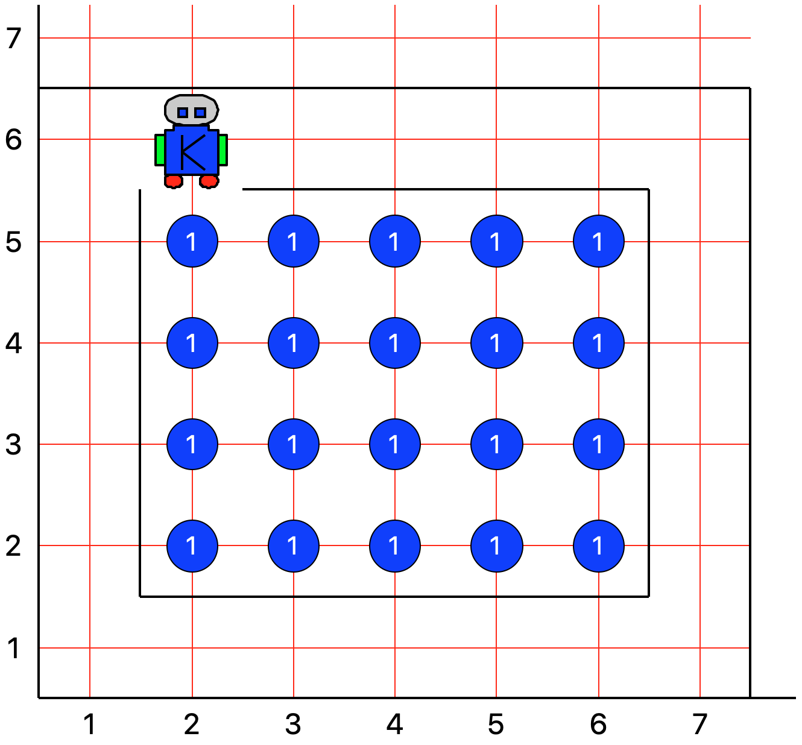
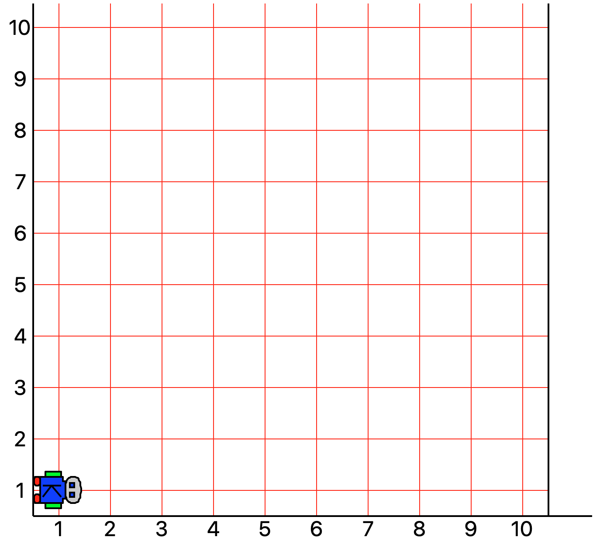
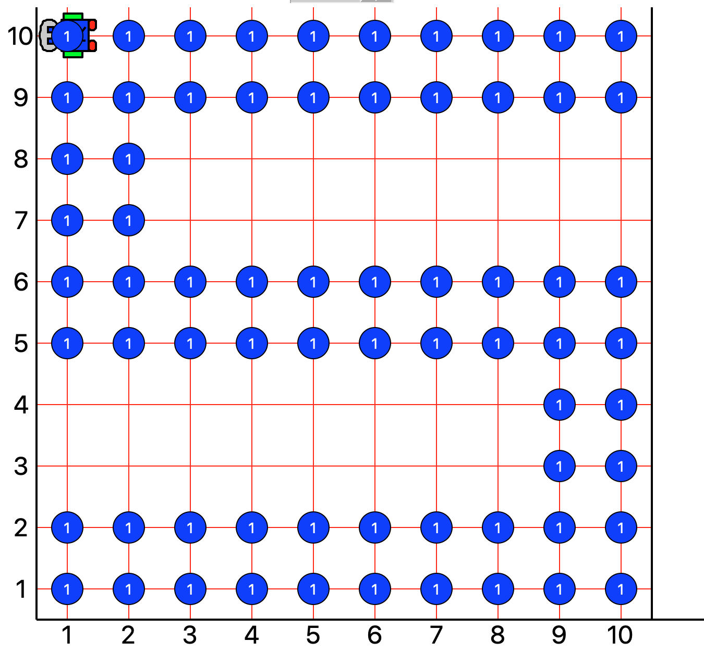

## CS-UY 1114 — Lab 1
# Karel Basics
#### September 10th & 11th, 2020

You will need a working Karel environment installed on your computer for this lab. **If you need help with this, please
contact a teaching assistant or instructor ASAP!**
 
All lab work must be submitted within 24 hours of the start of your lab period on Gradescope (we will be checking this
using the timestamps of your last submission on GradeScope). This, of course, also means that if you submit a solution 
before your allotted lab time, you will get no credit. You must try each problem at least once (that is, submitting at 
least one attempt to GradeScope, whether it is correct or not). You are welcome to continue to work on the problems and 
continue submitting to Gradescope until you are satisfied with your results. It is your responsibility to remember to 
submit your work.

Please note that your overall point value is awarded by the teaching assistants verifying that you attempted and
submitted each problem at least once!

### Problem 1

Before we begin, we would like to remind you that you have access to the _Karel In PyCharm_ reference guide, and may be
useful if you get stuck with running Karel programs. This can be found in the *references* folder in NYU Classes.

Okay, let's start with something simple. Pretend that Karel has to run a full lap around a 8x7 track-and-field course, such
as the one shown below:



_**Figure 1**: World `lab01_1.kwld`_

As you can see, Karel starts in a north-facing position, at location (1, 1). Your first task is to create a function,
called **`run_lap`**, that will have Karel complete a full lap around this track, ending once again at position (1, 1) 
and in a north-facing position. You may define any other helper functions if you have learned them in class and think
that they will help you.

For this problem, you may assume that neither the dimensions of the track nor Karel's initial position and direction 
will ever change. We have included sample comments in the skeleton **`run_lap`** function in the file `KarelMoving.py`
to give you an idea of what acceptable documentation may look like. Please follow this format for the documentation of 
the rest of your functions!

### Problem 2

For the next problem, we will be pretending our track is now a container, to be filled with beepers, and we've been 
tasked with programming Karel to do so. The pre-conditions look a bit like this:



_**Figure 2**: World `lab01_2.kwld` pre-conditions_

where Karel starts at position (1, 1), facing north. Create a function, **`fill_container`** (and any additional helper 
functions, if you wish), that will accomplish the following:



_**Figure 3**: World `lab01_2.kwld` post-conditions_

You may find that the instruction set inside **`fill_pothole`** will get pretty large pretty quickly. This is where
creating helper functions is helpful. For example, if you find that you are constantly using the following three
instructions:

```python
# 11 lines of code...
turn_left()
move()
turn_left()

move()

turn_left()
move()
turn_left()

move()

turn_left()
move()
turn_left()
```

you may find it helpful to create the following function:

```python
def left_u_turn():
    turn_left()
    move()
    turn_left()
  
# The same instructions are now 5 lines
left_u_turn()

move()

left_u_turn()

move()

left_u_turn()
```

and use **`left_u_turn`** instead of the other three. Completely up to you how you might want to structure your code,
and as always, ask any of the TAs for help should you need any guidance!

### Problem 3

Your last task will be a bit of a sandbox-type of exercise. You will be given a 20x20 world, with Karel starting at the
(1, 1) position, facing east:



_**Figure 4**: World `lab01_3.kwld` starting conditions_

Your task is to draw a shape of your choosing using beepers. It can be anything—a geometric shape, a letter, a 
character—as simple or as complicated as you like. It may be worth planning your shape on paper first to see if there
might be any sets of instructions that you can lump together into a function (not a requirement, of course, but it
might make your life easier). Here's an example of the letter *S* drawn using a function I wrote called **`draw_s`**:



_**Figure 5**: World `lab01_3.kwld` sample ending conditions_

In implementing my solution, I defined a couple of helper function that made my code a bit shorter such as:

```python
def turn_around():
    """
    Turns Karel to face the direction opposite to the one it is currently facing.
    """
    turn_left()
    turn_left()
```
